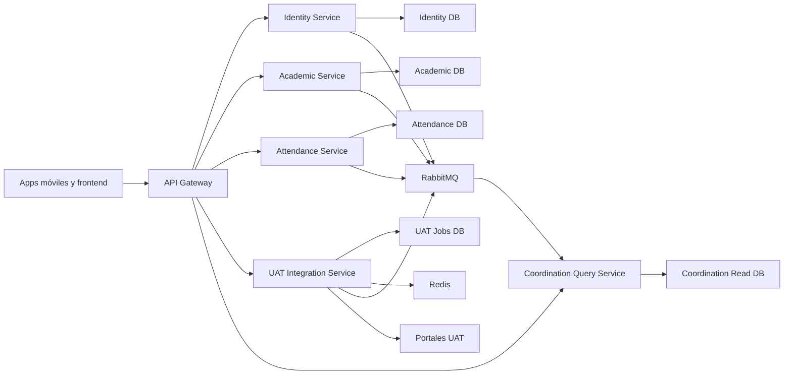

# Plan de migración a microservicios de Presencia

**Estado:** En implementación — Fase 7 (cierre, hardening y retiro gradual del legado)

**Fecha de decisión:** 2026-07-31

**Estrategia:** migración incremental por estrangulamiento (*strangler pattern*)

**Lenguaje principal:** TypeScript sobre Node.js 24 LTS

**Lenguaje excepcional:** Go, únicamente después de medir y aprobar un ADR específico

## 1. Propósito

Migrar el backend de Presencia a servicios desplegables y escalables de manera
independiente, sin una reescritura total, sin perder historial y sin obligar a
actualizar simultáneamente `app-profesor`, `app-alumno` y `frontend-coord`.

La migración debe corregir como parte del trabajo:

- secretos y accesos administrativos inseguros;
- eliminación destructiva de grupos durante la sincronización;
- endpoints públicos que exponen o modifican datos internos;
- escrituras de asistencia no atómicas;
- sesiones y eventos almacenados sólo en memoria;
- acoplamiento circular entre `backend` y `backend-apirest`;
- migraciones de base de datos con recuperación insegura;
- falta de pruebas del backend principal.

## 2. Decisiones fijadas

### 2.1 Lenguaje y runtime

- Los servicios nuevos se implementarán en TypeScript.
- El runtime de producción será Node.js 24 LTS, fijado por versión mayor y
  actualizado regularmente dentro de esa línea.
- El framework HTTP será Fastify 5.
- TypeScript se configurará con `strict`, `noUncheckedIndexedAccess` y
  `exactOptionalPropertyTypes`.
- Se prohíben `any`, `prisma as any`, `@ts-ignore` y dependencias cruzadas entre
  servicios.

Go sólo podrá introducirse cuando exista evidencia obtenida con perfiles y
pruebas de carga. La decisión requerirá un ADR que demuestre al menos una de
estas condiciones:

- trabajo sostenido intensivo en CPU que bloquee el event loop;
- consumo de memoria que impida cumplir el objetivo de densidad de réplicas;
- procesamiento masivo cuyo cuello de botella no sea PostgreSQL, RabbitMQ,
  Redis ni un portal externo;
- una mejora material frente a escalar horizontalmente el servicio TypeScript.

Las llamadas HTTP a UAT, consultas de base de datos y consumo de colas son
cargas de I/O y permanecerán en TypeScript salvo evidencia contraria.

### 2.2 Compatibilidad

- Los clientes conservarán inicialmente las rutas y formatos actuales.
- Un API Gateway será el único punto público de entrada.
- Los servicios internos no tendrán dominios públicos.
- La migración se realizará ruta por ruta mediante banderas de enrutamiento.
- No se utilizará una estrategia de corte total (*big bang*).

### 2.3 Datos

- Cada servicio será dueño exclusivo de su base lógica y sus migraciones.
- Las bases podrán compartir inicialmente el mismo clúster PostgreSQL, pero
  utilizarán bases, usuarios y credenciales distintas.
- Ningún servicio leerá tablas de otro servicio.
- No habrá claves foráneas entre bases de servicios.
- La integración se realizará mediante APIs versionadas y eventos durables.
- Las escrituras críticas utilizarán transacción local más outbox.
- Se conservarán los identificadores actuales durante el backfill.

### 2.4 Disponibilidad funcional

La asistencia y la vinculación de dispositivo son el núcleo del producto.
Una caída de UAT puede impedir actualizar horarios o calificaciones, pero no
debe impedir:

- abrir una clase ya sincronizada;
- registrar asistencia local;
- conservar el pase o vínculo del alumno;
- consultar el historial local;
- dejar la subida a UAT pendiente para reintento.

## 3. Arquitectura objetivo



## 4. Servicios y propiedad

### 4.1 API Gateway

Responsabilidades:

- terminar TLS mediante la infraestructura de Dokploy/Traefik;
- conservar las rutas públicas existentes;
- rate limiting y límites de tamaño;
- CORS por lista explícita;
- correlation ID y propagación de trazas;
- validación de JWT y metadatos básicos;
- enrutamiento por banderas durante la migración;
- ocultar los servicios internos.

No tendrá base de datos ni reglas de negocio.

Enrutamiento inicial:

| Prefijo | Destino final |
|---|---|
| `/auth/*` | Identity Service |
| `/professors/login` | Identity Service |
| `/professors/*` | Academic Service, con identidad validada |
| `/groups/*` | Academic Service |
| `/attendance/*` | Attendance Service |
| `/api/beacons/*` | Attendance Service |
| `/api/student-device-bindings/*` | Attendance Service |
| `/api/student-attendance/*` | Attendance Service |
| `/api/uat/*` | UAT Integration Service |
| `/api/coordinacion/*` | Coordination Query Service |
| `/api/superUsuario/auth/*` | Identity Service |
| `/api/superUsuario/beacons/*` | Attendance Service |
| `/api/superUsuario/coordinadores/*` | Identity Service |

El corte actual consolidó los clientes móviles bajo `/api/uat/*` y
`/api/student-device-bindings/*`. Los prefijos antiguos `/auth`, `/professors`,
`/groups`, `/attendance`, `/api/beacons` y `/api/student-attendance` ya no están
en la lista pública del Gateway. Los overrides sólo pueden cambiar el destino
de un contrato vigente y no pueden reactivar rutas retiradas.

### 4.2 Identity Service

Será dueño de:

- identidades de profesor y alumno;
- cuentas de coordinación;
- roles `PROFESSOR`, `STUDENT`, `COORDINATOR`, `READ_ONLY` y `SUPER_USER`;
- sesiones, revocación y política de dispositivo único;
- emisión y rotación de JWT;
- auditoría de accesos administrativos.

No almacenará contraseñas institucionales. Las credenciales UAT se enviarán al
UAT Integration Service para validación mediante un canal interno, se usarán
temporalmente y se descartarán.

El superusuario dejará de ser una contraseña global de entorno. Será una cuenta
con hash Argon2, rotación, sesión revocable y registro de auditoría.

### 4.3 Academic Service

Será dueño de:

- perfil académico de profesores;
- ciclos escolares;
- grupos y horarios;
- alumnos inscritos por grupo;
- clases compartidas;
- asignaciones de sustitución;
- estado activo/inactivo de grupos y matrículas.

La sincronización será diferencial:

1. recibir un snapshot validado desde UAT Integration;
2. hacer `upsert` por identificadores externos estables;
3. actualizar roster y horarios dentro de una transacción;
4. marcar ausencias del snapshot como inactivas;
5. conservar grupos, alumnos e identificadores referenciados por historial;
6. publicar el cambio mediante outbox.

Queda prohibido borrar grupos del ciclo antes de recrearlos.

### 4.4 Attendance Service

Será dueño de:

- sesiones y registros de asistencia;
- estados individualizados por alumno;
- entrada y salida del profesor;
- detecciones de presencia;
- beacons de salón;
- vinculaciones de dispositivo;
- configuración de tolerancias;
- estado local de publicación a UAT.

La captura de asistencia se realizará en una transacción única:

1. validar identidad y acceso al grupo;
2. validar que los alumnos pertenecen al roster o snapshot autorizado;
3. bloquear o versionar la sesión que se está modificando;
4. escribir cabecera y detalles;
5. insertar `attendance.upload_requested.v1` en outbox;
6. confirmar la transacción;
7. responder sin esperar a UAT.

El servicio conservará un snapshot mínimo del roster necesario para validar una
captura aunque Academic Service esté temporalmente fuera de línea.

Beacons y dispositivos permanecerán en este servicio durante la primera etapa.
Sólo se extraerán si presentan un patrón de carga o ciclo de despliegue realmente
independiente.

### 4.5 UAT Integration Service

Evolucionará a partir de `backend-apirest` y será dueño de:

- clientes HTTP de profesor y alumno;
- CookieJar y sesiones ASP.NET;
- adaptación de contratos UAT;
- cola durable de cargas de asistencia;
- cifrado temporal de credenciales requerido por trabajos pendientes;
- reintentos, backoff y dead-letter queue;
- publicación de resultados.

Cambios necesarios:

- mover sesiones de `Map` local a Redis con TTL y cifrado;
- reemplazar EventEmitter por RabbitMQ;
- separar coordinación, usuarios y reportes;
- limitar intentos contra login/snapshot;
- admitir varias réplicas sin sesiones pegadas a una instancia;
- no exponer el servicio directamente a Internet.

### 4.6 Coordination Query Service

Será un modelo de lectura reconstruible para:

- dashboard;
- profesores y coordinaciones;
- reportes semanales y por rango;
- infraestructura y vinculaciones;
- estado de sincronizaciones;
- vistas de clases compartidas y sustituciones.

Consumirá eventos de Identity, Academic, Attendance y UAT Integration. No será
dueño de grupos ni asistencias y no modificará bases ajenas. Los comandos del
panel se enviarán al servicio propietario correspondiente.

## 5. Contratos y comunicación

### 5.1 Comunicación síncrona

Se utilizará sólo cuando el cliente necesite una respuesta inmediata:

- login y emisión de sesión;
- lectura de grupo o historial;
- vinculación inicial del alumno;
- comandos administrativos interactivos.

Reglas:

- timeouts explícitos;
- máximo de reintentos acotado;
- `traceparent` y correlation ID;
- JWT interno con `issuer`, `audience` y expiración corta;
- circuit breaker para UAT;
- ninguna cadena síncrona de más de dos servicios para una petición normal.

### 5.2 Eventos asíncronos

Eventos iniciales versionados:

```text
identity.professor_authenticated.v1
identity.student_authenticated.v1
academic.roster_updated.v1
academic.group_deactivated.v1
academic.substitution_changed.v1
attendance.recorded.v1
attendance.corrected.v1
attendance.upload_requested.v1
attendance.device_bound.v1
attendance.device_unbound.v1
uat.attendance_uploaded.v1
uat.attendance_upload_failed.v1
uat.academic_snapshot_fetched.v1
```

Envelope obligatorio:

```json
{
  "eventId": "uuid",
  "eventType": "attendance.recorded.v1",
  "occurredAt": "2026-07-31T12:00:00.000Z",
  "producer": "attendance-service",
  "correlationId": "uuid",
  "causationId": "uuid",
  "aggregateId": "attendance-record-id",
  "schemaVersion": 1,
  "payload": {}
}
```

Todos los consumidores serán idempotentes. `eventId` tendrá restricción única
en su bandeja de entrada. Ningún evento contendrá contraseñas, cookies UAT,
tokens o información del dispositivo que no sea necesaria para el consumidor.

## 6. Organización del repositorio

```text
services/
  api-gateway/
  identity-service/
  academic-service/
  attendance-service/
  uat-integration-service/
  coordination-query-service/
packages/
  contracts-http/
  contracts-events/
  observability/
  test-helpers/
infra/
  compose/
  rabbitmq/
  postgres/
  dashboards/
docs/
  architecture/
  adr/
```

Cada servicio tendrá como mínimo:

```text
src/
  domain/
  application/
  infrastructure/
  presentation/
prisma/
tests/
Dockerfile
package.json
tsconfig.json
```

Los paquetes compartidos sólo podrán contener contratos, telemetría y utilidades
de prueba. No contendrán entidades de dominio, repositorios ni un Prisma Client
compartido.

## 7. Seguridad base

- Ningún secreto tendrá valor predeterminado en producción.
- Dokploy será la fuente de secretos de despliegue.
- CORS utilizará orígenes explícitos.
- Todos los endpoints se clasificarán como `public`, `authenticated`, `admin` o
  `internal` y tendrán pruebas de autorización.
- Los tokens de usuario tendrán audiencia específica.
- Los tokens internos serán distintos de los tokens de usuario.
- Cookies administrativas: `HttpOnly`, `Secure`, `SameSite=Strict` y path
  mínimo necesario.
- Rate limiting por IP y por identidad para login y comandos sensibles.
- Cifrado AES-256-GCM para credenciales temporales de trabajos UAT.
- Claves separadas para JWT, cifrado de trabajos y comunicación interna.
- Auditoría de login, cambios de rol, beacons, desvinculaciones y sustituciones.
- La vista HTML de asistencia se eliminará o utilizará escape estricto y CSP.

## 8. Migración de datos sin pérdida

Para cada servicio extraído:

1. inventariar tablas, relaciones, índices y volumen;
2. crear la nueva base y migraciones versionadas;
3. crear herramienta de backfill reanudable;
4. copiar datos conservando IDs y timestamps;
5. instalar outbox en el propietario legado para capturar deltas;
6. consumir deltas en la base nueva;
7. comparar conteos, claves naturales y hashes por lotes;
8. ejecutar lecturas sombra;
9. cambiar primero lecturas y después escrituras, o hacerlo en una ventana
   controlada cuando el dominio lo requiera;
10. conservar ruta de rollback hasta terminar reconciliación;
11. volver de sólo lectura las tablas legadas;
12. retirar tablas únicamente después del periodo de estabilización y backup.

No se harán dual-writes directos desde el handler HTTP a dos bases. La
replicación utilizará transacción local más outbox para evitar estados parciales.

## 9. Despliegue y operación

### 9.1 Etapa inicial

- Monorepo actual.
- Docker por servicio.
- Dokploy y red privada.
- Un clúster PostgreSQL con bases separadas.
- Redis administrado.
- RabbitMQ con almacenamiento persistente.
- Traefik como entrada externa y API Gateway como entrada de aplicación.

No se incorporará Kubernetes en esta etapa. Se evaluará únicamente cuando las
necesidades de réplicas, despliegue o recuperación superen lo que Dokploy puede
operar con claridad.

### 9.2 Salud y observabilidad

Cada servicio expondrá:

- `/health/live`: el proceso está vivo;
- `/health/ready`: dependencias críticas disponibles;
- `/metrics`: métricas Prometheus en red interna;
- logs JSON con `service`, `version`, `traceId` y `correlationId`.

Métricas mínimas:

- latencia y errores por endpoint;
- conexiones y latencia PostgreSQL/Redis;
- profundidad de colas y DLQ;
- antigüedad del trabajo UAT más viejo;
- reintentos y rechazos del portal;
- eventos pendientes en outbox;
- divergencias detectadas durante reconciliación.

## 10. Estrategia de pruebas

### 10.1 Por servicio

- pruebas unitarias de dominio y aplicación;
- pruebas de repositorio con PostgreSQL real mediante Testcontainers;
- pruebas HTTP por inyección Fastify;
- pruebas de autorización por rol;
- pruebas de migración desde un snapshot representativo;
- pruebas de eventos e idempotencia;
- pruebas de contrato OpenAPI.

### 10.2 Integración

- gateway a servicio;
- publicación outbox a RabbitMQ;
- consumo repetido del mismo evento;
- caída y reinicio de worker durante una subida;
- indisponibilidad de UAT con asistencia local funcional;
- dos réplicas atendiendo sesiones UAT;
- backfill seguido de cambios incrementales;
- compatibilidad con las tres aplicaciones actuales.

### 10.3 Carga y resiliencia

- login concurrente;
- consulta de grupos en hora de entrada;
- captura simultánea por múltiples profesores;
- sincronización offline por lotes;
- cola UAT acumulada y recuperación gradual;
- reinicio de Redis, RabbitMQ y una réplica de servicio;
- restauración de base desde backup.

Los objetivos numéricos de latencia y capacidad se fijarán después de medir una
línea base del sistema actual. No se declarará un servicio escalable sólo por
haberlo separado.

## 11. Fases de implementación

### Fase 0 — Hardening y línea base

Avance al 31 de julio de 2026:

- [x] Secretos de producción obligatorios y sin valores de desarrollo.
- [x] CORS explícito y rate limiting de autenticación.
- [x] CRUD anónimo retirado y resoluciones operativas acotadas al profesor.
- [x] Vinculación de celular autorizada con token acotado y almacenamiento seguro.
- [x] Migraciones fail-closed; no se marcan fallos como aplicados.
- [x] Sincronización académica no destructiva para el historial existente.
- [x] Captura principal de asistencia transaccional con validación de roster.
- [ ] Backup y restauración comprobados en un entorno de prueba.
- [ ] Inventario OpenAPI y pruebas de caracterización completas.
- [ ] Línea base de carga, latencia y errores en un entorno representativo.

Entregables:

- secretos obligatorios y separados;
- rate limiting de autenticación;
- cierre de CRUD públicos;
- eliminación del XSS;
- migraciones que fallen de forma segura;
- backup y prueba de restauración;
- inventario de rutas y tablas;
- pruebas de caracterización del backend legado;
- métricas de carga actuales.

Criterio de salida:

- no existen credenciales predeterminadas en producción;
- ningún endpoint administrativo es anónimo;
- los contratos actuales están capturados;
- existe un rollback de base comprobado.

### Fase 1 — Fundación de plataforma

Avance al 2 de agosto de 2026: estructura de workspaces, contratos HTTP/eventos,
API Gateway, Redis, RabbitMQ, PostgreSQL aislado por servicio y Compose para
Dokploy implementados. Falta instrumentación OpenTelemetry y validación real de
contenedores en un host con Docker.

Entregables:

- estructura `services/`, `packages/` e `infra/`;
- Node.js 24 LTS en desarrollo, CI y contenedores;
- configuración TypeScript estricta común;
- API Gateway con rutas al legado;
- RabbitMQ y Redis en compose de desarrollo;
- contratos HTTP/eventos versionados;
- OpenTelemetry, logs y health checks;
- plantilla de servicio.

Criterio de salida:

- todo el tráfico puede pasar por el gateway sin cambiar respuestas;
- una ruta puede cambiar de destino mediante configuración;
- trazas cruzan gateway y backend legado.

### Fase 2 — UAT Integration Service

Avance al 2 de agosto de 2026: sesiones de profesor/alumno cifradas en Redis,
circuit breakers, rate limit, bus durable con outbox/inbox, reintentos y DLQ
implementados. Coordination Query ya fue extraído; el E2E con portales UAT
reales requiere cuentas de prueba autorizadas.

Entregables:

- `backend-apirest` actualizado a Node.js 24/Fastify 5;
- sesiones serializadas en Redis;
- eventos durables;
- worker de asistencia endurecido;
- rate limiting y circuit breaker;
- rutas internas protegidas;
- eliminación progresiva de coordinación del servicio.

Criterio de salida:

- reiniciar una réplica no invalida sesiones ni pierde trabajos;
- dos réplicas procesan sin duplicar una subida;
- UAT puede estar caído sin perder capturas pendientes.

### Fase 3 — Identity Service

Avance al 3 de agosto de 2026: Redis, JWT revocable/rotable, auditoría e
integración posterior a autenticación UAT implementados. Identity ya posee las
cuentas coordinadoras y las sesiones de coordinación/superusuario. Un job
idempotente adopta las cuentas legadas sin sobrescribir cambios posteriores;
el BFF conserva las URLs públicas y delega los recursos a su propietario. Se
retiraron el JWT, el CRUD runtime y el job de escritura de cuentas locales; el
bootstrap configurado se crea directamente en Identity.

Entregables:

- cuentas y sesiones migradas;
- login UAT orquestado de forma segura;
- roles y autorización central;
- superusuario como identidad real;
- JWT rotables y revocables;
- auditoría de seguridad.

Criterio de salida:

- todas las rutas protegidas aceptan una identidad emitida por el servicio;
- cerrar o revocar una sesión tiene efecto en todas las réplicas;
- no se almacenan contraseñas institucionales.

### Fase 4 — Academic Service

Avance al 3 de agosto de 2026: servicio aislado con base propia, snapshots
diferenciales de profesores/grupos/rosters y alumnos/carreras/horarios,
idempotencia, conservación no destructiva y outbox RabbitMQ implementados. El
backfill/reconciliación de grupos para Coordination Query implementados. Clases
compartidas y permisos revocables hacia Attendance implementados. Sólo el
modelo distinto de sustituciones temporales conserva su fachada histórica.

Entregables:

- profesores, grupos, alumnos, ciclos y sustituciones migrados;
- sincronización diferencial;
- eventos académicos;
- backfill y reconciliación;
- rutas de grupos detrás del gateway.

Criterio de salida:

- resincronizar nunca elimina historial;
- repetir el mismo snapshot es idempotente;
- grupos retirados quedan inactivos y consultables históricamente.

### Fase 5 — Attendance Service

Avance al 3 de agosto de 2026: servicio aislado con base propia, roster local,
captura serializable e idempotente, outbox, carga UAT durable, resultado
versionado, vinculación UUID autoritativa y auditoría de cambios implementados.
La escritura, renovación del token móvil, lectura del dashboard y resolución
autorizada para el profesor ya usan este propietario sin dual-write. Beacons,
entrada/salida del profesor y detecciones BLE pertenecen a Attendance; las
rutas instaladas sólo actúan como fachadas de compatibilidad durante el corte.

Entregables:

- asistencia, dispositivos y beacons migrados;
- captura transaccional;
- validación de pertenencia al roster;
- idempotencia de peticiones móviles;
- outbox de subida UAT;
- reconciliación de resultados UAT;
- autorización de vinculaciones y CRUD administrativo.

Criterio de salida:

- no existen asistencias parciales;
- una petición repetida no duplica datos;
- una caída de UAT deja el trabajo pendiente y no bloquea la app;
- ningún alumno puede modificar la vinculación de otra matrícula.

### Fase 6 — Coordination Query Service

Avance al 2 de agosto de 2026: modelo de lectura aislado, consumidor RabbitMQ
idempotente, reportes semanal/rango, adaptación del BFF y reconciliación desde
snapshots de Academic/Attendance implementados. El despliegue real debe medir
la demora de proyección para fijar alertas.

Entregables:

- read models por eventos;
- dashboard y reportes migrados;
- rutas administrativas delegadas al propietario;
- reconstrucción completa del modelo de lectura;
- frontend funcionando sin cambios de contrato.

Criterio de salida:

- eliminar y reconstruir la base de lectura produce los mismos resultados;
- coordinación no lee bases de otros servicios;
- la demora de proyección se mide y alerta.

### Fase 7 — Corte y retiro del legado

Avance al 3 de agosto de 2026: contratos públicos conservados, Gateway único,
rutas internas bloqueadas, cortes configurables y documentación de Dokploy,
smoke test y rollback implementados. Attendance ya posee la configuración de
beacons y la telemetría BLE, con importación idempotente y fachadas para móviles
instalados. Academic ya posee las clases compartidas, importa el estado anterior
y entrega a Attendance permisos revocables por eventos. Las apps móviles ya
consumen UAT Integration y los microservicios propietarios; el Gateway rechaza
las rutas antiguas. El proceso HTTP `backend` fue retirado del Compose y las
herramientas debug quedaron deshabilitadas con mutaciones `410`. Sólo permanecen
la imagen y la base histórica para los imports one-shot de beacons y migraciones
hasta validar el primer despliegue y su restauración. La cosecha UAT dejó de
escribir la proyección local de profesores, materias, coordinaciones y grupos:
Academic es su único destino y Identity/Academic son dependencias obligatorias
con readiness explícito.

Entregables:

- cambio gradual de todas las rutas;
- periodo de observación y rollback;
- tablas legadas en sólo lectura;
- eliminación de proxies circulares;
- retiro del proceso `backend` monolítico;
- actualización de documentación y diagramas operativos.

Criterio de salida:

- ningún cliente llama servicios internos directamente;
- no existen accesos cruzados a bases;
- todos los dominios tienen propietario y runbook;
- el backend legado puede apagarse sin afectar tráfico.

### Fase 8 — Escala y recuperación

Entregables:

- pruebas de carga y caos;
- políticas de réplicas por servicio;
- alertas y dashboards;
- backups automatizados por base;
- restauración ensayada;
- runbooks de incidentes;
- revisión de necesidad real de Go o Kubernetes.

Criterio de salida:

- se cumplen los SLO definidos con carga objetivo;
- se recupera un servicio y sus datos desde cero;
- una caída parcial no elimina ni duplica asistencia.

## 12. Orden sugerido de pull requests

1. `security/fail-closed-production-config`
2. `security/protect-admin-routes-and-rate-limit`
3. `fix/preserve-groups-and-attendance-on-sync`
4. `test/legacy-http-contract-characterization`
5. `chore/node-24-typescript-strict-baseline`
6. `infra/api-gateway-legacy-routing`
7. `infra/rabbitmq-outbox-observability`
8. `service/uat-redis-sessions`
9. `service/uat-durable-events-and-private-network`
10. `service/identity-access`
11. `service/academic-catalog-and-roster`
12. `service/attendance-core-and-device-binding`
13. `service/coordination-read-model`
14. `migration/gateway-cutover-and-legacy-retirement`

Cada PR debe poder desplegarse y revertirse de forma independiente. Los cambios
de esquema deberán ser compatibles hacia atrás durante el periodo de corte.

## 13. Riesgos y mitigaciones

| Riesgo | Mitigación |
|---|---|
| Pérdida de historial durante backfill | backups, IDs preservados, hashes y reconciliación |
| Eventos duplicados | inbox con `eventId` único e idempotencia |
| Evento perdido después de commit | outbox dentro de la misma transacción |
| Demasiados servicios para operar | sólo seis deployables y extracción por dominio |
| Latencia por cadenas síncronas | máximo dos saltos y modelos locales de lectura |
| UAT inestable | circuit breaker, cola durable y degradación funcional |
| Contratos móviles incompatibles | gateway y pruebas de caracterización |
| Sesiones perdidas entre réplicas | Redis con TTL y cifrado |
| Datos divergentes durante corte | backfill reanudable, delta por eventos y shadow reads |
| Introducir Go prematuramente | ADR y métricas obligatorias |

## 14. Definición de terminado por servicio

Un servicio no se considera extraído hasta que:

- posee su base y migraciones;
- no accede a tablas externas;
- tiene contratos versionados;
- publica mediante outbox;
- consume eventos idempotentemente;
- tiene pruebas unitarias, integración y contrato;
- tiene health checks, métricas, trazas y logs;
- tiene rate limiting y autorización cuando corresponda;
- tiene backup, restauración y runbook;
- puede desplegarse y escalarse independientemente;
- dispone de rollback probado;
- el código equivalente del legado quedó retirado o deshabilitado.

## 15. Primer hito ejecutable

El primer hito no debe extraer todavía Academic ni Attendance. Debe entregar:

1. corrección de los bloqueadores críticos de seguridad y datos;
2. contratos y pruebas de caracterización de rutas actuales;
3. actualización a Node.js 24 LTS;
4. gateway apuntando al legado;
5. RabbitMQ, Redis y observabilidad base;
6. `backend-apirest` privado con sesiones Redis;
7. despliegue de al menos dos réplicas de UAT Integration sin pérdida de sesión.

Al aprobar este hito se inicia Identity Service. Este orden reduce riesgo antes
de mover el dominio de asistencia y deja preparada una ruta de rollback real.
